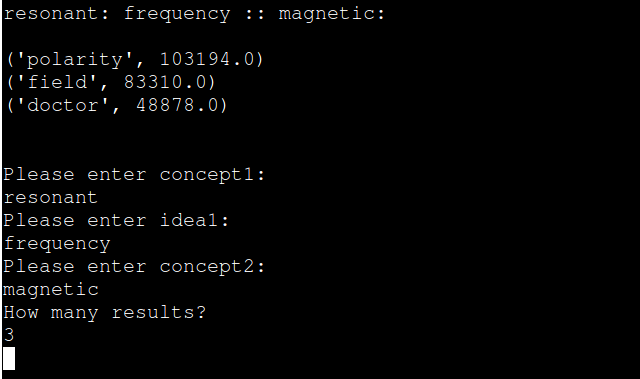

# semantic-compositions

This project encodes hierarchical relationships between words in parse trees using high dimensional vectors and random indexing. It then uses these stored relationships to draw analogies between different words.

# How it works
Newly encountered words are generated a random, binary vector containing -1s and 1s that is stored as an environment vector. Each newly generated word additionally is given a memory vector that is the linear combination of the environment vectors of surrounding words multiplied by their part of speech and their structural relationship (each of which is also symbolically represented by a random, binary vector of -1s and 1s).

The structural relationship is encoded as the movements needed to move from one word to another on the parse tree hierarchically. For example, the movement required to move from one leaf node to an adjacent leaf node when they have the same parent would be "up, down", which would be encoded as "10". Similarly, if moving from one word to another requires moving up the tree twice and then moving down three times, then the movement would be encoded as "11000". These movements are symbolically represented by a random, binary vectors consisting of -1s and 1s.

For more information, see the poster that I made for a conference [here](CULC13_Poster.pdf).

# Running the program

To use, run `main.py`. This is currently running parse trees from [1000 sentences from the British National Corpus database](http://nclt.computing.dcu.ie/~jfoster/resources/bnc1000.html).

The program will prompt you to input concept1, idea1, concept2, and number of results respectively. These represent m_1, s_2, and m_2 respectively where the analogy you want to find from the data is "m_1 is to s_2 as m_2 is to what?"

Here is a sample output:

# License
semantic-compositions is available under the MIT license. See `LICENSE` file in the repository.